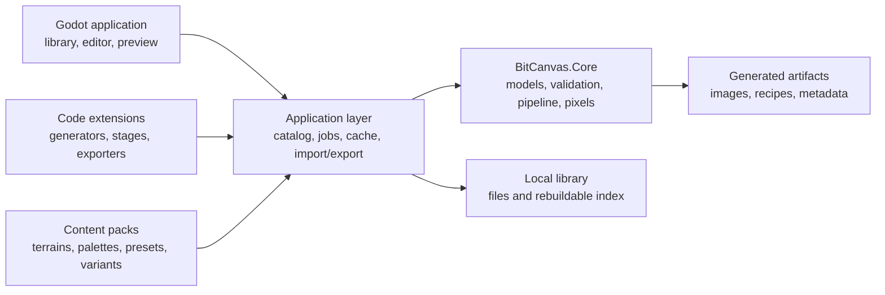

# BitCanvas: Extensible Architecture

[Guide] [Architecture] [Tooling]

This document defines the target architecture for BitCanvas as an independent Godot application
for generating, organizing and exporting graphics. The target is a library that can grow to hundreds
of terrains and variants without requiring a code change for every new asset. It is a design
baseline, not a statement that the proposed components have already been implemented.

## 1. Goals and boundaries

BitCanvas should provide a consistent authoring workflow for terrain, furniture and future graphic
families. It should make generation repeatable, content discoverable, and output easy to reproduce
and export. A new terrain should normally be a data definition built from an existing generator,
palette and output profile, not a new branch in application code.

BitCanvas is a standalone graphics tool. It is not part of the game's runtime or simulation. The game
may consume exported PNGs, atlases, furniture data or other declared formats, but BitCanvas must not
depend on game assemblies or game state. Game-specific naming and layout belong in an exporter or
output profile.

The current application is a plain HTML/JavaScript tool. Its terrain and side rendering lives mainly
in `BitCanvas/core.js`, `BitCanvas/terrain.js` and `BitCanvas/sides.js`; furniture definitions are in
`BitCanvas/furnitureData.js`; the UI, preview and export controls are coordinated by
`BitCanvas/app.js`. Those files describe current behavior and are useful as a migration reference.

## 2. Architectural principles

- **Keep the generation core independent.** Core algorithms use .NET types only; they do not use
  Godot nodes, resources, controls or global application state.
- **Prefer declarative content.** Palettes, terrain recipes, parameter defaults, labels, tags and
  variant sets are data. Code is added when the generation capability itself is new.
- **Make generated results reproducible.** A saved recipe records the inputs and exact generator
  versions required to recreate an output.
- **Separate source from output.** Definitions and source assets are not overwritten by generated
  files, previews or exported game assets.
- **Treat extensions as versioned contracts.** Discovery, validation and compatibility failures are
  visible; conflicting content IDs never silently replace one another.
- **Keep the first implementation modular, not distributed.** This is a desktop authoring tool; a
  modular application and a local catalog are simpler than services or a plugin marketplace.

## 3. Main components



### 3.1 `BitCanvas.Core`

A standalone .NET class library. It owns stable domain models, parameter validation, deterministic
randomness, pixel buffers, generation contracts, pipeline validation and generation algorithms.
It returns plain data such as RGBA buffers and diagnostics. It does not create Godot textures or
write into a game project.

Recommended areas are `Domain`, `Generation`, `Imaging`, `Validation`, `Serialization` and
`Determinism`. Pixel data should use a documented channel order, dimensions, color space and alpha
convention. A compact contiguous buffer is preferable to one object per pixel.

### 3.2 `BitCanvas.Application`

Coordinates use cases without owning rendering algorithms or UI. Its responsibilities include
catalog discovery, pack dependency resolution, recipe loading and saving, asynchronous generation
jobs, cancellation, progress, cache lookup, import/export orchestration and user-facing diagnostics.
The application layer turns a validated request into a core generation request and exposes progress
and results to the UI.

### 3.3 Godot application and adapters

The Godot project owns windows, controls, navigation, input, previews and platform file dialogs. It
adapts core pixel buffers into Godot images and textures. Keep Godot resource and node creation on the
main thread; generation and other pure CPU work can run on worker tasks and return plain buffers.

Parameter controls should be generated from a parameter schema. A generator declaring a numeric
range, choice, color or toggle should receive a matching editor control without adding a dedicated
panel implementation for that generator.

### 3.4 Catalog and persistence

Content manifests and recipe files are the source of truth. A local SQLite database may index
installed content, search fields, favorites, collections and generation history. Treat this database
as rebuildable catalog state, not as the only copy of user content. User preferences can be stored
separately from content definitions.

## 4. Generation model

A generation request resolves a content definition and output profile, validates and normalizes all
parameters, derives deterministic seeds, then executes a typed pipeline. The pipeline can contain
stages such as base surface generation, detail, edge treatment, side-face generation, variant
assembly and atlas packing. Stages declare their input and output artifact types so incompatible
combinations fail validation rather than producing malformed images.

Keep the initial pipeline typed and staged. Do not build a generic visual node editor until there is
a concrete authoring need that the staged model cannot express. A node editor is a separate product
feature, not a prerequisite for having an extensible generator framework.

Conceptual contracts:

```csharp
public interface IGeneratorProvider
{
    IEnumerable<IGeneratorDescriptor> GetGenerators();
}

public interface IGeneratorDescriptor
{
    string Id { get; }
    int Version { get; }
    ParameterSchema Parameters { get; }
    ValidationResult Validate(GenerationParameters parameters);
    GenerationResult Generate(GenerationRequest request, CancellationToken cancellationToken);
}

public interface IExporter
{
    string Id { get; }
    ExportResult Export(GeneratedAsset asset, ExportRequest request);
}
```

These are illustrative contracts, not a frozen public API. Keep the eventual public API small and
version it independently from content schemas.

### 4.1 Terrain definitions and variants

A terrain definition selects a generator, palette, parameter values, output profiles and a variant
policy. It does not embed a copy of the generator algorithm. A variant set references the same
definition and derives distinct seeds or explicit parameter overrides for each named variant.

Use a stable variant ID as part of seed derivation. Do not derive a variant solely from its position
in a list: inserting a new variant must not silently change all existing variant images.

Example content definition:

```json
{
  "id": "etherbound.terrain.grass-meadow",
  "generator": {
    "id": "bitcanvas.terrain.grass",
    "version": 1
  },
  "palette": "etherbound.palette.grass.meadow",
  "parameters": {
    "density": 6,
    "brightness": 58,
    "dirtSpecks": false
  },
  "variants": {
    "count": 4,
    "seedMode": "stable-id"
  },
  "outputs": [
    "bitcanvas.iso-tile-64x32",
    "bitcanvas.terrain-side-sheet"
  ]
}
```

Use namespaced, stable IDs for generators, palettes, profiles, packs and content. Display names,
descriptions, categories and tags are metadata and may change without changing identity.

### 4.2 Determinism and recipes

The effective generation identity is the normalized recipe: content ID, generator ID and version,
normalized parameters, palette ID and version, root seed, stable variant ID, pipeline configuration,
and output profile version. Derive independent deterministic random streams for stages and variants
from that identity. Do not use `System.Random`, wall-clock time, load order or thread scheduling as
generation inputs.

Save a recipe beside exported output. It should contain enough information to identify and reproduce
the generation, including the source pack and versions. If a generator changes output, increment its
version or provide an explicit migration; never imply that old recipes remain byte-identical when
they do not.

## 5. Extension system

There are two extension mechanisms with different trust and compatibility rules.

### 5.1 Content packs

Content packs add data and static assets: terrain definitions, palettes, presets, furniture recipes,
icons, previews and output-profile declarations. They can be installed from a directory or imported
from a ZIP with the same internal layout. Content packs cannot execute scripts.

Each pack manifest should declare a stable pack ID, pack version, supported content-schema version,
dependencies and contained content IDs. The loader validates all referenced generators, palettes,
profiles and files before exposing the pack in the catalog. A malformed pack is rejected with a
diagnostic and does not prevent other packs from loading.

### 5.2 Code extensions

Code extensions add capabilities: generator implementations, typed processing stages, validators or
exporters. Initially, register built-in extensions statically from the application solution. This
allows the contracts to evolve against real use without prematurely committing to a public plugin
SDK.

After the API is stable, BitCanvas may load external managed assemblies from an explicit trusted
location. A C# assembly loaded in-process is not sandboxed and must be treated as trusted code. If
untrusted third-party extensions are required, run them out-of-process with a narrow serialized
request/result protocol instead of claiming that in-process loading is secure.

The extension API needs its own semantic version and declared compatibility range. Report missing
dependencies, incompatible API versions, duplicate IDs and dependency cycles. Do not silently
override a generator or content definition with the same ID.

### 5.3 Generic parameter UI

Parameter schemas should define ID, label, type, default, constraints and optional choices. The first
supported types should cover integer/decimal ranges, booleans, enumerations, colors and palette
references. Add conditional visibility only when a real generator needs it. Invalid or unknown
parameters should be reported during pack validation rather than ignored silently.

## 6. Resource and file organization

Keep application code, built-in content, user-installed packs, editable projects, generated cache and
user exports in distinct locations. One suggested source layout is:

```text
src/
  BitCanvas.Core/
    Domain/
    Generation/
    Imaging/
    Validation/
    Serialization/
  BitCanvas.Application/
    Catalog/
    Jobs/
    Caching/
    ImportExport/
  BitCanvas.Godot/
    UI/
    ViewModels/
    Adapters/
extensions/
  BitCanvas.Extensions.BuiltIn/
content/
  builtin/
    etherbound/
      pack.json
      terrains/
      palettes/
      furniture/
      output-profiles/
      icons/
tests/
  BitCanvas.Core.Tests/
  BitCanvas.GoldenTests/
```

At runtime, built-in content may be read from `res://`; it is read-only in exported applications.
Installed packs, workspaces and caches should live outside the exported package, such as under
Godot's user-data directory or a user-selected path. Use portable JSON and image files for external
packs so the application can load them without relying on the Godot editor's asset-import pipeline.
Never assume that a packaged application can write generated files into `res://`.

Recommended user-data layout:

```text
user-data/
  packs/<pack-id>/
  projects/<project-id>/
    project.json
    terrains/<terrain-id>.json
    recipes/<recipe-id>.json
  cache/<content-hash>/
  library-index.sqlite
  settings.json
exports/<user-selected-destination>/
```

The exact physical root is platform-specific. Preserve the logical separation even if a user chooses
to keep projects and exports elsewhere. Generated cache is disposable; source definitions and
recipes are not.

Output profiles define dimensions, layout, variant ordering, file names, alpha behavior and format.
Examples include a single isometric tile, a four-variant atlas, terrain side sheets, furniture sprite
sets and a game-specific export layout. Game integration belongs in a profile/exporter, not in the
terrain generator.

## 7. Scaling to a large library

Hundreds of definitions are a catalog and workflow problem more than a rendering problem. The
application should:

- Load and index metadata before decoding previews or generating images.
- Support search, tags, categories, favorites and collections.
- Virtualize or page long lists; do not create a Godot node for every catalog entry.
- Generate previews lazily and cancel obsolete jobs when parameters change.
- Limit worker concurrency and expose progress for batch generation.
- Cache results by a content hash of the complete normalized recipe and output profile.
- Keep rendering stages stateless so independent variants can run in parallel safely.
- Bound memory by releasing unused preview textures and evicting old cache entries by policy.
- Show per-pack and per-asset diagnostics without aborting catalog discovery for unrelated content.

Benchmark batch generation with representative terrain families, variant counts and output sizes.
Record elapsed time, peak memory, cache hit rate and cancellation responsiveness; do not optimize by
adding shared mutable random state or by making generation depend on worker order.

## 8. Compatibility and verification

Treat deterministic pixels, package validation and export layout as observable contracts.

- Unit-test seed hashing, derived seeds, parameter normalization, palette lookup, validation and
  each generator's core behavior.
- Keep golden raw pixel buffers for representative seeds and parameter boundaries. Compare decoded
  pixel data rather than compressed PNG bytes, since PNG encoders may vary their compression while
  preserving the same image.
- During migration, compare C# output against the existing JavaScript generator for fixed seeds.
  Visual review alone is insufficient to catch changes to transparent pixels, seams or alpha.
- Test pack loading with valid, malformed, duplicate-ID, missing-dependency and incompatible-version
  fixtures.
- Test recipe save/load and regeneration, including generator version changes.
- Test exporters for expected names, dimensions, alpha rules and stable variant order.
- Add benchmarks for catalog startup, preview generation, batch generation and cache reuse.

Keep all Godot-dependent tests at the application boundary. Core generation tests should run as plain
.NET tests without starting a Godot scene or requiring a GPU.

## 9. Migration stages

1. **Capture the current contract.** Record representative seeds, terrain tiles, side sheets, cliff
   sheets and furniture outputs. Write down current file names, dimensions and alpha behavior.
2. **Extract the deterministic core.** Port pixel buffers, seeded hashing and generation algorithms
   into `BitCanvas.Core`. Keep the JavaScript implementation as a temporary oracle for parity tests.
3. **Move content into versioned data.** Convert palettes, terrain presets, output profiles and
   declarative furniture recipes out of UI code. Replace executable content definitions such as
   `decorate` callbacks with data or a named built-in operation where practical.
4. **Build the independent Godot application.** Add generic schema-driven controls, preview,
   background jobs, cancellation, file dialogs and explicit output profiles.
5. **Add the catalog and content-pack workflow.** Validate, index, search, install and remove data
   packs; keep the index rebuildable from pack files.
6. **Stabilize extension contracts.** Use built-in code extensions first. Add external trusted
   assembly loading only after multiple real generators and exporters demonstrate a stable API.

Each stage should preserve the separation between generation, content, UI and exporters. Avoid
replacing the whole tool in one change; the golden-output migration makes partial transitions
verifiable.

## 10. Deferred choices

These choices do not block the initial modular design and should be made only when a concrete use
case requires them:

- Public marketplace or remote pack registry.
- External in-process DLL plugins versus an out-of-process extension host.
- A visual node-graph authoring interface.
- GPU generation or shader-based processing for workloads proven CPU-bound by benchmarks.
- Cloud synchronization or shared team libraries.

The initial implementation should use local content packs, built-in code extensions, CPU generation
and file-based recipes.

---

## TL;DR

Build BitCanvas as an independent Godot front end over a Godot-free deterministic C# core. Make
terrain variants and palettes declarative content packs; reserve code extensions for genuinely new
algorithms and exporters. Keep content files as the source of truth, use a rebuildable catalog index
and content-addressed cache, and validate the migration against deterministic pixel goldens.
